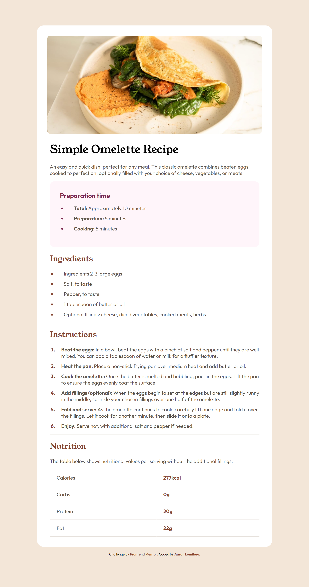

# Frontend Mentor - Recipe page solution

## Table of contents

- [Overview](#overview)
  - [The challenge](#the-challenge)
  - [Screenshot](#screenshot)
  - [Links](#links)
- [My process](#my-process)
  - [Built with](#built-with)
  - [What I learned](#what-i-learned)
  - [Continued development](#continued-development)
  - [Useful resources](#useful-resources)
- [Author](#author)
- [Acknowledgments](#acknowledgments)

## Overview

### The challenge

Your challenge is to build out this recipe page and get it looking as close to the design as possible.

You can use any tools you like to help you complete the challenge. So if you've got something you'd like to practice, feel free to give it a go.

Want some support on the challenge? [Join our community](https://www.frontendmentor.io/community) and ask questions in the **#help** channel.

### Screenshot

Blog preview card quick view

### Links

- Solution URL: [GitHub](https://github.com/AaronL9/Recipe-page.git)
- Live Site URL: [Social-links-profile](https://aaronl9.github.io/Recipe-page/)

## My process

### Built with

- Semantic HTML5 markup
- CSS custom properties
- Flexbox

### What I learned

I have just learned how to deal with tables and use media query in right situation.

### Continued development

I want to continuously improve how I write CSS.

### Useful resources

- [MDN](https://developer.mozilla.org/en-US/) - This documentation help me a lot to understand
  concept of HTML, CSS, and JavaScript.

## Author

- Website - [Aaron Lomibao](https://aaron-lomibao-portfolio.netlify.app/)
- Frontend Mentor - [@AaronL9](https://www.frontendmentor.io/profile/AaronL9)

## Acknowledgments

none
